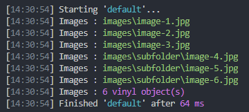

# gulp-vinyl-flow   

Allows you to check Vinyl files, streams or buffers, going through your Gulp™ pipeline(s).



### Install  [](https://www.npmjs.com/package/gulp-vinyl-flow)

```sh
$ npm install gulp-vinyl-flow --save-dev
```

### Usage

```js
const gulp = require('gulp');
const debug = require('gulp-vinyl-flow');

exports.default = () => (
  gulp.src('static/images/**/*.{jpg,png}', {base:'static'})
    .pipe(debug('Images'))
    .pipe(gulp.dest('dist'));
);
```

### API

#### gulp-vinyl-flow([title | options])

- **title** (`string`)\
Same as `options.title`.
- **options**
  - **title** (`string` | Default: `Vinyl`)\
  Allow a custom title to distinguish outputs over potential multiple logging instances.
  - **minimal** (`boolean` | Default: `true`) **v1.1.0+**\
  By default only vinyl.relative is shown. With Minimal off will also show cwd, base & path.
  - **showFiles** (`boolean` | Default: `true`)\
  Print `vinyl.relative`.
  - **showCount** (`boolean` | Default: `true`)\
  Print the vinyl files count.
